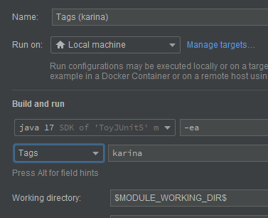
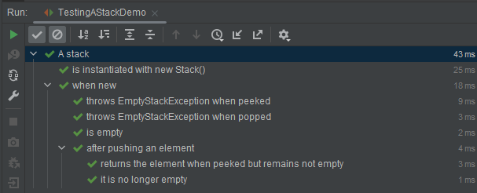
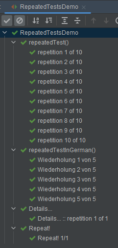
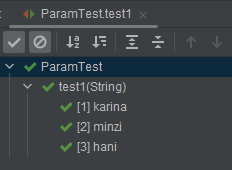

# JUnit 5

[Junit 5 User Guide](https://junit.org/junit5/docs/current/user-guide/#overview)를 참고하며,  
부분적으로 JUnit in Action 3rd Edition <sub>written Cătălin Tudose</sub>을 참고했다.

## What is JUnit5?


JUnit 5 = JUnit Platform + JUnit Jupiter + JUnit Vintage

- JUnit Platform: foundation for launching testing framework on JVM
    - console launcher, JUnit Platform Suit Engine
    - exist in IDE <sub>IntelliJ, Eclipse, Visual Studio Code</sub>
- JUnit Jupiter: combination of the programming model and extension model
    - provide `TestEngine`
- JUnit Vintage: provide `TestEngine` for JUnit 3 and 4

### Demo

```java
import static org.junit.jupiter.api.Assertions.assertEquals;

import example.util.Calculator;
import org.junit.jupiter.api.Test;

class MyFirstJUnitJupiterTests {

    private final Calculator calculator = new Calculator();

    @Test
    void addition() {
        assertEquals(2, calculator.add(1, 1));
    }

}
```

## Definition

- Platform
    - Container: 트리에서 `test class`를 가지는 컨테이너
    - Test : 테스트 트리의 노드 (e.g.a `@Test` method)
- Jupiter
    - Lifecycle Method : `@BeforeAll`, `@AfterAll`, `@BeforeEach`, `@AfterEach` 가 있는 메서드
    - Test Class : 최소 1개 이상의 테스트 메서드를 가지는 클래스 <sub>top-level class, static member class or `@Nested` class</sub>
    - Test Method : `@Test`, `@RepeatedTest`, `@ParameterizedTest`, `@TestFactory`, `@TestTemplate` 가 있는 인스턴스 메서드

## Test Classes and Methods

- Teest Method와 Lifecycle Method는 테스트 클래스의 로컬로 선언되거나
    - 수퍼클래스에서 상속되거나
    - 인터페이스에서 상속 될 수 있음
- Test Method와 Lifecycle Method는 `abstract`일 수 없음

### Display Names

`@DisplayName` : 테스트 클래스와 테스트 메서드에 사용할 수 있는 테스트 이름을 지정

<details>
    <summary>Demo</summary>

```java
import org.junit.jupiter.api.DisplayName;
import org.junit.jupiter.api.Test;

@DisplayName("A special test case")
class DisplayNameDemo {

    @Test
    @DisplayName("Custom test name containing spaces")
    void testWithDisplayNameContainingSpaces() {
    }

    @Test
    @DisplayName("╯°□°）╯")
    void testWithDisplayNameContainingSpecialCharacters() {
    }

    @Test
    @DisplayName("😱")
    void testWithDisplayNameContainingEmoji() {
    }

}
```

</details>

### Display Name Generators

<details>
    <summary>Demo</summary>

```java
import org.junit.jupiter.api.*;
import org.junit.jupiter.params.ParameterizedTest;
import org.junit.jupiter.params.provider.ValueSource;

public class DisplayNameGeneratorDemo {

    @Nested
    @DisplayNameGeneration(DisplayNameGenerator.ReplaceUnderscores.class)
    class A_year_is_not_supported {

        @Test
        void if_it_is_zero() {
        }

        @DisplayName("A negative value for year is not supported by the leap year computation.")
        @ParameterizedTest(name = "For example, year {0} is not supported.")
        @ValueSource(ints = {-1, -4})
        void if_it_is_negative(int year) {
        }
    }

    @Nested
    @IndicativeSentencesGeneration(separator = " -> ", generator = DisplayNameGenerator.ReplaceUnderscores.class)
    class A_year_is_a_leap_year {

        @Test
        void if_it_is_divisible_by_4_but_not_by_100() {
        }

        @ParameterizedTest(name = "Year {0} is a leap year.")
        @ValueSource(ints = {2016, 2020, 2048})
        void if_it_is_one_of_the_following_years(int year) {
        }
    }
}

```

</details>

<details>
    <summary>Demo result</summary>

  

</details>

### Display Name 우선순위

1. `@DisplayName`
2. `@DisplayNameGeneration`의 `DisplayNameGenerator`
3. 설정 파라미터의 `DisplayNameGenerator`
4. `org.junit.jupiter.api.DisplaNameGenerator.Standard`

## Assertions

- `org.junit.jupiter.api.Assertions` : 테스트 결과를 검증하는 메서드를 제공

<details>
    <summary>Demo</summary>

````java
import org.junit.jupiter.api.DisplayName;
import org.junit.jupiter.api.Test;

import java.util.ArrayList;
import java.util.Arrays;
import java.util.List;
import java.util.concurrent.CountDownLatch;

import static java.time.Duration.ofMillis;
import static java.time.Duration.ofMinutes;
import static org.junit.jupiter.api.Assertions.*;

@DisplayName("Assert static methods demo")
public class AssertionsDemo {

    private final Calculator cal = new Calculator();
    private final Idol karina = new Idol.Builder("카리나", 20).isLeader(1).build();

    @Test
    @DisplayName("Standard assertions")
    void standardAssertions() {
        assertEquals(2, cal.add(1, 1));
        assertEquals(4, cal.multiply(2, 2),
                "The optional failure message is now the last parameter");
        assertEquals("카리나", karina.getMemberName(), () -> karina.toString() + "의 이름이 카리나인지 확인");
    }

    @Test
    @DisplayName("Grouped assertions (Failures)")
    void groupAssertions() {

        assertAll("karina",
                () -> assertEquals("카리나", karina.getMemberName()),
                () -> assertEquals(20, karina.getAge()));

    }

    @Test
    void dependentAssertions() {

        assertAll("karina variables",
                () -> {
                    String name = karina.getMemberName();
                    assertNotNull(name);
                    assertAll("name conventions rule",
                            () -> assertEquals(3, name.length()),
                            () -> assertTrue(name.startsWith("카")));

                },
                () -> {
                    int age = karina.getAge();
                    assertAll("age conventions rule",
                            () -> assertTrue(age > 0),
                            () -> assertTrue(age < 30));
                });
    }

    @Test
    void exceptionTesting() {
        Exception exception = assertThrows(ArithmeticException.class, () ->
                cal.divide(1, 0));
        assertEquals("/ by zero", exception.getMessage());
    }

    @Test
    @DisplayName("timeoutNotExceeded")
    void timeoutNotExceeded() {
        String actualResult = assertTimeout(ofMinutes(2), () -> {
            return "a result";
        });
        assertEquals("a result", actualResult);
    }

    @Test
    @DisplayName("timeoutNotExceededWithMethod")
    void timeoutNotExceededWithMethod() {
        String actualGreeting = assertTimeout(ofMinutes(2), AssertionsDemo::greeting);
        assertEquals("Hello, World!", actualGreeting);
    }

    private static String greeting() {
        return "Hello, World!";
    }

    @Test
    @DisplayName("timeoutExceeded")
    void timeoutExceeded() {
        assertTimeout(ofMillis(10), () -> {
            Thread.sleep(100);
        });
    }

    @Test
    void timeoutExceededWithPreemptiveTermination() {
        // The following assertion fails with an error message similar to:
        // execution timed out after 10 ms
        assertTimeoutPreemptively(ofMillis(10), () -> {
            // Simulate task that takes more than 10 ms.
            new CountDownLatch(1).await();
        });
    }

}

````

</details>

### third-party assertion library

- JUnit 팀도 third-party assertion library를 사용하는 것을 권장
    - ex. `AssertJ`, `Hamcrest`, `Truth`

<details>
    <summary>Demo</summary>

```java
import org.junit.jupiter.api.DisplayName;
import org.junit.jupiter.api.Test;

import static org.hamcrest.CoreMatchers.equalTo;
import static org.hamcrest.CoreMatchers.is;
import static org.hamcrest.MatcherAssert.assertThat;

@DisplayName("Assert static methods demo")
public class AssertionsDemo {

    private final Idol karina = new Idol.Builder("카리나", 20).isLeader(1).build();

    @Test
    @DisplayName("third-party library")
    void thirdPartyLib() {
        assertThat(karina.getAge(), is(equalTo(20)));
    }

}
```

</details>

## Assumptions

- 테스트의 진행 조건 부여 가능
- 조건이 만족되지 않으면 테스트는 실행되지 않음

<details>
    <summary>Demo</summary>

```java
import org.junit.jupiter.api.DisplayName;
import org.junit.jupiter.api.Test;

import static org.junit.jupiter.api.Assertions.assertEquals;
import static org.junit.jupiter.api.Assumptions.assumeTrue;
import static org.junit.jupiter.api.Assumptions.assumingThat;

public class AssumptionsDemo {

    private final Idol karina = new Idol.Builder("카리나", 20).isLeader(1).build();

    @Test
    @DisplayName("test only on ci server")
    void testOnlyCiServer() {
        assumeTrue("CI".equals(System.getenv("ENV")));
    }

    @Test
    @DisplayName("test only on dev server")
    void testOnlyDevServer() {
        assumeTrue("DEV".equals(System.getenv("ENV")),
                () -> "Aborting test: not on developer workstation");
    }

    @Test
    @DisplayName("CI server test and All environment test")
    void testInAllEnvironments() {
        assumingThat("CI".equals(System.getenv("ENV")),
                () -> {
                    // perform only in CI server
                    assertEquals(20, karina.getAge());
                });

        assertEquals("카리나", karina.getMemberName());
    }
}
```

</details>

## Disabling Tests

- `@Disabled` 어노테이션을 사용하여 테스트를 비활성화
- 클래스, 메서드 레벨에 가능

<details>
    <summary>Demo</summary>

```java
import org.junit.jupiter.api.Disabled;
import org.junit.jupiter.api.Test;

public class AssumptionsDemo {

    @Test
    @Disabled("Disabled until ready for production server")
    void testProduction() {

    }
}
```

</details>

## Conditional Test Execution <sup>조건부 테스트 실행</sup>

- 프로그래밍적인 조건부로 테스트 실행
- `org.junit.jupiter.api.condition` 패키지 : 컨테이너나 테스트를 선언적오르 사용 / 미사용 처리 가능

### OS, Architecture 조건

<details>
    <summary>Demo</summary>

````java
public class ConditionTest {

    @TestOnMac
    void testOnMac() {
    }

    @Test
    @EnabledOnOs({OS.LINUX, OS.MAC})
    void onLinuxOrMac() {
    }

    @Test
    @EnabledOnJre({JRE.JAVA_8, JRE.JAVA_9})
    void onlyOnJava89() {
    }

    @Test
    @EnabledIfSystemProperty(named = "os.arch", matches = ".*64.*")
    void onlyOn64BitArchitectures() {
    }

    @Test
    @DisabledIf("customCondition")
    void disabled() {
    }

    boolean customCondition() {
        return true;
    }

    @Test
    @EnabledIf("example.ExternalCondition#customCondition")
    void enabled() {
    }

}
// ...
package example;

class ExternalCondition {
    static boolean customCondition() {
        return true;
    }

}

````

</details>

- `@EnabledOnOs`, `@DisabledOnOs`
- `@EnabledOnJre`, `@DisabledOnJre`
- `@EnabledOnJreRange`, `@DisabledOnJreRange`
- `@EnabledInNativeImage`, `@DisabledInNativeImage` : GraalVM Native Image
- `@EnabledIfSystemProperty`, `@DisabledIfSystemProperty`

--- 

## Tagging and Filtering <sup>태그와 필터링</sup>

- `@Tag` 어노테이션을 사용하여 테스트를 태그하고,
- 테스트 시 필터링 가능

<details>
    <summary>Demo</summary>

```java
import org.junit.jupiter.api.Tag;
import org.junit.jupiter.api.Test;

@Tag("fast")
@Tag("model")
class TaggingDemo {

    @Test
    @Tag("karina")
    void testingKarina() {
    }

    @Test
    void testSomething() {
    }

}

```

</details>



## Test Execution Order <sup>테스트 실행 순서</sup>

- default, 테스트 순서는 보장되지 않는 알고리즘에 의해 진행
- 테스트 순서 지정 가능

### Method Order

- 테스트에 순서가 필요할 떄가 있음
    - ex. 통합 테스트, 기능 테스트와 같이 단위의 순서가 중요할 떄
- `@TestMethodOrder` 어노테이션을 사용하여 테스트 순서 지정 가능
    - `MethodOrderer.DisplayName` : 테스트 메서드 이름 순서
    - `MethodOrderer.MethodName` : 테스트 메서드 이름 순서
    - `MethodOrderer.Random` : 무작위 순서
    - `MethodOrderer.OrderAnnotation` : `@Order` 어노테이션을 사용하여 테스트 순서 지정
    - ~~`MethodOrderer.Alphanumeric` : 알파벳 순서~~ <sub>deprecated since 6.0</sub>

<details>
    <summary>Demo</summary>

```java
import org.junit.jupiter.api.*;

@TestMethodOrder(MethodOrderer.OrderAnnotation.class)
class OrderedTestsDemo {

    @Test
    @Order(1)
    void first() {
    }

    @Test
    @Order(2)
    void second() {
    }

    @Test
    @Order(3)
    void third() {
    }
}

```  

</details>

### Class Order

테스트 클래스의 순서가 필요할 때가 있음

- fail fast mode
- shortest test plan execution duration mode
- 그 외 다수

`junit.jupiter.testclass.order.default`의 `ClassOrderer`

- `ClassOrder.ClassName` : 클래스 이름을 기준으로 순서 설정
- `ClassOrder.DisplayName` : DisplayName을 기준으로 순서 설정
- `ClassOrder.OrderAnnotation` : `@Order` 어노테이션을 사용하여 테스트 순서 지정
- `ClassOrder.Random` : 무작위 순서

<details>
    <summary>Demo</summary>

```java
import org.junit.jupiter.api.*;

@TestClassOrder(ClassOrderer.OrderAnnotation.class)
public class OrderedNestedTestClassesDemo {

    @Nested
    @Order(1)
    class FirstTest {
        @Test
        void test1() {
        }
    }

    @Nested
    @Order(2)
    class SecondTest {
        @Test
        void test2() {
        }
    }
}
```

</details>

## Test Instance Lifecycle

기본값은 `Lifecycle.PER_CLASS` : 메서드마다 테스트 클래스 인스턴스 생성

### per-class mode

- 클래스의 모든 테스트 메서드를 해당 클래스의 단일 테스트 인스턴스에서 실행
- `@TestInstance(Lifecycle.PER_CLASS)`
- non-static 메서드, interface default 메서드, `@Nested` 클래스의 메서드에 `@BeforeAll`, `@AfterAll` 선언 가능

### Changing the Default Test Instance Lifecycle

- ex. `-Djunit.jupiter.testinstance.lifecycle.default=per_class`
- JVM 시스템 파라미터로서 할당 가능
- `src/test/resources/junit-platform.properties` 파일에 할당 가능
    - 버전관리 가능해서 용이한 방법

<details>
    <summary>Demo</summary>

```java
import org.junit.jupiter.api.Test;
import org.junit.jupiter.api.TestInstance;

@TestInstance(TestInstance.Lifecycle.PER_CLASS)
public class LifecycleTest {

    private int flag = 0;

    @Test
    void plus1() {
        flag++;
    }

    @Test
    void plus2() {
        flag++;
    }
}
```

</details>

## Nested Tests

- `@Nested` : 테스트 메서드를 그룹화
- Outer class가 실행되고 Inner Class가 실행됨
- Outer class의 setup code는 항상 실행됨

<details>
    <summary>Demo</summary>

```java

import org.junit.jupiter.api.BeforeEach;
import org.junit.jupiter.api.DisplayName;
import org.junit.jupiter.api.Nested;
import org.junit.jupiter.api.Test;

import java.util.EmptyStackException;
import java.util.Stack;

import static org.junit.jupiter.api.Assertions.*;

@DisplayName("A stack")
public class TestingAStackDemo {

    private Stack<Object> stack;

    @Test
    @DisplayName("is instantiated with new Stack()")
    void isInstantiatedWithNew() {
        new Stack<>(); // stack 인스턴스 생성
    }

    @Nested
    @DisplayName("when new")
    class WhenNew {

        @BeforeEach
        void createNewStack() {
            stack = new Stack<>();
        }

        @Test
        @DisplayName("is empty")
        void isEmpty() {
            assertTrue(stack.isEmpty());
        }

        @Test
        @DisplayName("throws EmptyStackException when popped")
        void throwsExceptionWhenPopped() {
            assertThrows(EmptyStackException.class, stack::pop);
        }

        @Test
        @DisplayName("throws EmptyStackException when peeked")
        void throwsExceptionWhenPeeked() {
            assertThrows(EmptyStackException.class, stack::peek);
        }

        @Nested
        @DisplayName("after pushing an element")
        class AfterPushing {
            String anElement = "an element";

            @BeforeEach
            void pushAnElement() {
                stack.push(anElement);
            }

            @Test
            @DisplayName("it is no longer empty")
            void isNotEmpty() {
                assertFalse(stack.isEmpty());
            }

            @Test
            @DisplayName("returns the element when peeked but remains not empty")
            void returnElementWhenPeeked() {
                assertEquals(anElement, stack.peek());
                assertFalse(stack.isEmpty());
            }
        }
    }
}
```

</details>

<details>
    <summary>Demo result</summary>



</details>

## DI for Constructors and Methods

- JUnit Jupiter는 테스트 클래스의 생성자와 테스트 메서드에 DI를 지원
- `ParameterResolver` API : 런타임에 동적으로 파라미터 resolve
- `TestInfoParameterResolver` : 최근 컨테이너나 테스트의 속성을 제곰 <sub>ex. `displayName`</sub>
- `RepititionInfoParameterResolver` : `@RepeatedTest`에서만 사용 가능
- `TestReporterParameterResolver` : 테스트 실행에 대한 추가적인 정보를 생성 가능

## Test Interfaces and Default Methods

- 테스트 어노테이션을 인터페이스 `default` 메서드에 선언 가능
    - `@Test`, `@RepeatedTest`, `@ParameterizedTest`, `@TestFactory`, `@TestTemplate`, `@BeforeEach`, `@AfterEach`, `@BeforeAll`, `@AfterAll`

<details>
    <summary>Demo</summary>

```java
// 테스트 클래스
public class TestInterfaceDemo implements TestLifecycleLogger, TimeExecutionLogger, TestInterfaceDynamicTestsDemo {

    @Test
    void isEqualValue() {
        assertEquals(1, 1, "is always equal");
    }
}

// 테스트마다 로깅하는 인터페이스
@TestInstance(Lifecycle.PER_CLASS)
interface TestLifecycleLogger {

    static final Logger logger = Logger.getLogger(TestLifecycleLogger.class.getName());

    @BeforeAll
    default void beforeAllTests() {
        logger.info("Before all tests");
    }

    @AfterAll
    default void afterAllTests() {
        logger.info("After all tests");
    }

    @BeforeEach
    default void beforeEachTest(TestInfo testInfo) {
        logger.info(() -> String.format("About to execute [%s]",
                testInfo.getDisplayName()));
    }

    @AfterEach
    default void afterEachTest(TestInfo testInfo) {
        logger.info(() -> String.format("Finished executing [%s]",
                testInfo.getDisplayName()));
    }
}

// 테스트 데이터를 동적으로 반환하는 팩터리
public interface TestInterfaceDynamicTestsDemo {

    @TestFactory
    default Stream<DynamicTest> dynamicTestsForPalindromes() {
        return Stream.of("racecar", "radar", "mom", "dad")
                .map(text -> DynamicTest.dynamicTest(text, () -> {
                    System.out.println("text = " + text);
                }));
    }
}

@Tag("timed")
@ExtendWith(TimingExtension.class)
public interface TimeExecutionLogger {
}

// 테스트 실행시간을 측정
public class TimingExtension implements BeforeTestExecutionCallback, AfterTestExecutionCallback {
    private static final Logger logger = Logger.getLogger(TimingExtension.class.getName());

    private static final String START_TIME = "start time";


    @Override
    public void beforeTestExecution(ExtensionContext extensionContext) throws Exception {
        getStore(extensionContext).put(START_TIME, System.currentTimeMillis());

    }

    @Override
    public void afterTestExecution(ExtensionContext extensionContext) throws Exception {
        Method testMethod = extensionContext.getRequiredTestMethod();
        long startTime = getStore(extensionContext).remove(START_TIME, long.class);
        long duration = System.currentTimeMillis() - startTime;

        logger.info(() -> String.format("Method [%s] took %s ms.", testMethod.getName(), duration));
    }

    private Store getStore(ExtensionContext context) {
        return context.getStore(ExtensionContext.Namespace.create(getClass(), context.getRequiredTestMethod()));
    }

}

```

</details>

#### 실행 순서

1. `TestLifecycleLogger`
    1. `beforeAllTests()`
    2. `beforeEach()`
2. `TimingExtension` > `beforeTestExecution()`
3. `TestInterfaceDynamicTestsDemo` > `dynamicTestsForPalindromes()`

## Repeated Tests

- `@RepeatedTest` : n번 반복 테스트
- `currentRepetition`, `totalRepetitions`

<details>
    <summary>Demo</summary>

```java
import org.junit.jupiter.api.DisplayName;
import org.junit.jupiter.api.RepeatedTest;

import static org.junit.jupiter.api.Assertions.assertEquals;

public class RepeatTest {

    @RepeatedTest(value = 10, name = "{displayName} {currentRepetition}/{totalRepetitions}")
    @DisplayName("repeat test")
    void repeatedTest() {
        assertEquals(1, 1);
        System.out.println("repeatedTest");
    }
}
```

</details>

<details>
    <summary>Demo</summary>

```java
import org.junit.jupiter.api.*;

import java.util.logging.Logger;

import static org.junit.jupiter.api.Assertions.assertEquals;

public class RepeatedTestsDemo {

    private Logger logger = Logger.getLogger(RepeatedTestsDemo.class.getName());

    @BeforeEach
    void beforeEach(TestInfo testInfo, RepetitionInfo repetitionInfo) {
        int currentRepetition = repetitionInfo.getCurrentRepetition();
        int totalRepetitions = repetitionInfo.getTotalRepetitions();
        String methodName = testInfo.getTestMethod().get().getName();
        logger.info(String.format("About to execute repetition %d of %d for %s", currentRepetition, totalRepetitions, methodName));
    }

    @RepeatedTest(10)
    void repeatedTest() {
        // ...
    }

    @RepeatedTest(value = 1, name = "{displayName} {currentRepetition}/{totalRepetitions}")
    @DisplayName("Repeat!")
    void customDisplayName(TestInfo testInfo) {
        assertEquals(testInfo.getDisplayName(), "Repeat! 1/1");
    }

    @RepeatedTest(value = 1, name = RepeatedTest.LONG_DISPLAY_NAME)
    @DisplayName("Details...")
    void customDisplayNameWithLongPattern(TestInfo testInfo) {
        assertEquals("Details... :: repetition 1 of 1", testInfo.getDisplayName());
    }

    @RepeatedTest(value = 5, name = "Wiederholung {currentRepetition} von {totalRepetitions}")
    void repeatedTestInGerman() {
        // ...
    }
}
```

</details>

<details>
    <summary>Demo result</summary>



</details>

## Parameterized Tests

#### `@ValueSource`

- 리터럴 값을 담는 1차배열 가능
    - `short`, `byte`, `int`, `long`, `float`, `double`, `char`, `boolean`, `java.lang.String`, `java.lang.Class`
- `@AutoCloseable` 구현체를 사용하려면 `@ParameterizedTest(autoCloseArguments = false)`를 통해 비활성화해서 재사용 가능

<details>
    <summary>Demo</summary>

```java
import org.junit.jupiter.params.ParameterizedTest;
import org.junit.jupiter.params.provider.ValueSource;

import static org.junit.jupiter.api.Assertions.assertTrue;

public class ParamTest {

    @ParameterizedTest
    @ValueSource(strings = {"karina", "minzi", "hani"})
    void test1(String name) {
        assertTrue(name.length() < 7);
    }

    @ParameterizedTest
    @NullAndEmptySource // @NullSource + @EmptySource
    @ValueSource(strings = {" ", "   ", "\t", "\n"})
    void nullEmptyAndBlankStrings(String text) {
        assertTrue(text == null || text.trim().isEmpty());
    }
}
```



</details>

#### `@EnumSource`

- Enum 상수 주입

<details>
    <summary>Demo</summary>

```java

public class ParamTest {

    private Logger logger = Logger.getLogger(ParamTest.class.getName());

    @ParameterizedTest
    @EnumSource
    void testWithEnumSourceWithAutoDetection(ChronoUnit unit) {
        logger.info(unit.toString());
        assertNotNull(unit);
    }


    @ParameterizedTest
    @EnumSource(names = {"DAYS", "HOURS"})
    void testWithEnumSourceInclude(ChronoUnit unit) {
        logger.info(unit.toString());
        assertTrue(EnumSet.of(ChronoUnit.DAYS, ChronoUnit.HOURS).contains(unit));
    }

    @ParameterizedTest
    @EnumSource(mode = EXCLUDE, names = {"ERAS", "FOREVER"})
    void testEnumSourceExclude(ChronoUnit unit) {
        logger.info(unit.toString());
        assertFalse(EnumSet.of(ChronoUnit.ERAS, ChronoUnit.FOREVER).contains(unit));
    }

    @ParameterizedTest
    @EnumSource(mode = MATCH_ALL, names = "^.*DAYS$")
    void testWithEnumSourceRegex(ChronoUnit unit) {
        assertTrue(unit.name().endsWith("DAYS"));
    }

}
```

</details>

#### `@MethodSource`

- 1개 이상의 팩터리 메서드를 참조

<details>
    <summary>Demo</summary>

```java
import org.junit.jupiter.api.extension.*;
import org.junit.jupiter.params.ParameterizedTest;
import org.junit.jupiter.params.provider.Arguments;
import org.junit.jupiter.params.provider.MethodSource;

import java.util.List;
import java.util.logging.Logger;
import java.util.stream.IntStream;
import java.util.stream.Stream;

import static org.junit.jupiter.api.Assertions.*;
import static org.junit.jupiter.params.provider.Arguments.arguments;

public class ParamTest {

    private Logger logger = Logger.getLogger(ParamTest.class.getName());

    @ParameterizedTest
    @MethodSource("idolProvider")
    void testWithExplicitLocalMethodSource(String argument) {
        logger.info(argument);
        assertNotNull(argument);
    }

    static Stream<String> idolProvider() {
        return Stream.of("karina", "minzi", "hani");
    }

    @ParameterizedTest
    @MethodSource
    void testWithDefaultLocalMethodSource(String argument) {
        logger.info(argument);
        assertNotNull(argument);
    }

    static Stream<String> testWithDefaultLocalMethodSource() {
        return Stream.of("karina", "minzi", "hani");
    }

    @ParameterizedTest
    @MethodSource("idolGroupProvider")
    void testWithMultiArgMethodSource(String groupName, int num, List<String> memberList) {
        assertNotNull(groupName);
        assertTrue(num >= 1);
        assertTrue(memberList.size() > 0);
    }

    static Stream<Arguments> idolGroupProvider() {
        return Stream.of(
                Arguments.of("NewJeans", 1, List.of("hani", "minzi")),
                Arguments.of("IVE", 2, List.of("Rei")),
                Arguments.of("IU", 3, List.of("solo"))
        );
    }

    @ParameterizedTest
    @MethodSource("IdolProvider#idolGroupProvider")
    void testWithExternalMethodSource(String groupName, int num, List<String> memberList) {
        assertNotNull(groupName);
        assertTrue(num >= 1);
        assertTrue(memberList.size() > 0);
    }

    class IdolProvider {
        static Stream<Arguments> idolGroupProvider() {
            return Stream.of(
                    Arguments.of("NewJeans", 1, List.of("hani", "minzi")),
                    Arguments.of("IVE", 2, List.of("Rei")),
                    Arguments.of("IU", 3, List.of("solo"))
            );
        }
    }

    @ParameterizedTest
    @MethodSource("range")
    void testWIthRangeMethodSource(int argument) {
        logger.info("argument : " + argument);
        assertNotEquals(9, argument);
    }

    static IntStream range() {
        return IntStream.range(0, 20).skip(10);
    }

    @RegisterExtension // IntegerResolver 확장
    static final IntegerResolver integerResolver = new IntegerResolver();

    @ParameterizedTest
    @MethodSource("factoryMethodWithArguments")
    void testWithFactoryMethodWithArguments(String argument) {
        assertTrue(argument.startsWith("2"));
    }

    static Stream<Arguments> factoryMethodWithArguments(int quantity) {
        return Stream.of(
                arguments(quantity + " apples"),
                arguments(quantity + " lemons")

        );
    }

    static class IntegerResolver implements ParameterResolver {

        @Override
        public boolean supportsParameter(ParameterContext parameterContext, ExtensionContext extensionContext) throws ParameterResolutionException {
            return parameterContext.getParameter().getType() == int.class;
        }

        @Override
        public Object resolveParameter(ParameterContext parameterContext, ExtensionContext extensionContext) throws ParameterResolutionException {
            return 2;
        }
    }
}
```

</details>

#### `@CsvSource`

- CSV 포맷의 문자열을 주입

<details>
    <summary>Demo</summary>

```java
import org.junit.jupiter.params.ParameterizedTest;
import org.junit.jupiter.params.provider.CsvSource;

import java.util.logging.Logger;

import static org.junit.jupiter.api.Assertions.assertNotNull;

/**
 * @ParameterizedTest 예시
 */
public class ParamTest {

    private Logger logger = Logger.getLogger(ParamTest.class.getName());

    @ParameterizedTest
    @CsvSource({"karina, Aespa", "minzi, NewJeans", "hani, NewJeans"})
    void testWithCsvSource(String name, String group) {
        logger.info(name + " " + group);
        assertNotNull(name);
        assertNotNull(group);
    }

    @ParameterizedTest(name = "[{index}] {arguments}")
    @CsvSource(useHeadersInDisplayName = true, textBlock = """
            name, group
            karina, Aespa
            minzi, NewJeans
            hani, NewJeans
            """)
    void testWithCsvSourceWithHeader(String name, String group) {
        logger.info(name + " " + group);
        assertNotNull(name);
        assertNotNull(group);
    }

    @ParameterizedTest
    @CsvSource(useHeadersInDisplayName = true, delimiter = '|', quoteCharacter = '"', textBlock = """
            name| group
            "karina"| "Aespa"
            "minzi"| "NewJeans"
            "hani"| "NewJeans"
            """)
    void testWithCsvSourceWithDelimiterAndQuote(String name, String group) {
        logger.info(name + " " + group);
        assertNotNull(name);
        assertNotNull(group);
    }
}
```

</details>

#### `@CsvFileSource`

- CSV 파일을 주입

<details>
    <summary>Demo</summary>

```java

import org.junit.jupiter.params.ParameterizedTest;
import org.junit.jupiter.params.provider.CsvFileSource;

import java.util.logging.Logger;

import static org.junit.jupiter.api.Assertions.assertNotNull;

public class ParamTest {

    private Logger logger = Logger.getLogger(ParamTest.class.getName());

    @ParameterizedTest
    @CsvFileSource(resources = "resource/Idol.csv", numLinesToSkip = 1)
    void testWithCsvFileSource(String name, String group) {
        logger.info(name + " " + group);
        assertNotNull(name);
        assertNotNull(group);
    }
}
```

</details>

#### `@ArgumentsSource`

- `ArgumentsProvider` 구현체를 통해 인자를 주입

<details>
    <summary>Demo</summary>

```java
import org.junit.jupiter.api.extension.ExtensionContext;
import org.junit.jupiter.params.ParameterizedTest;
import org.junit.jupiter.params.provider.Arguments;
import org.junit.jupiter.params.provider.ArgumentsProvider;
import org.junit.jupiter.params.provider.ArgumentsSource;

import java.util.logging.Logger;
import java.util.stream.Stream;

import static org.junit.jupiter.api.Assertions.assertNotNull;

public class ParamTest {

    private Logger logger = Logger.getLogger(ParamTest.class.getName());


    @ParameterizedTest
    @ArgumentsSource(IdolArgumentProvider.class)
    void testWithArgumentsSource(String name) {
        logger.info(name);
        assertNotNull(name);
    }

    static class IdolArgumentProvider implements ArgumentsProvider {

        @Override
        public Stream<? extends Arguments> provideArguments(ExtensionContext extensionContext) {
            return Stream.of("karina", "minzi", "hani").map(Arguments::of);
        }
    }
}

```

</details>

### Argument Conversion

#### Widening Conversion

<details>
    <summary>Demo</summary>

```java
import org.junit.jupiter.params.ParameterizedTest;
import org.junit.jupiter.params.provider.ValueSource;

import static org.junit.jupiter.api.Assertions.assertNotNull;

public class ArgumentConversionTest {
    @ParameterizedTest
    @ValueSource(ints = {1, 2, 3})
    void testWithWideningArgumentConversion(double argument) {
        assertNotNull(argument); // argument = 1.0, 2.0, 3.0
    }
}

```

</details>

#### Implicit  Conversion

<details>
    <summary>Demo</summary>

```java
import org.junit.jupiter.params.ParameterizedTest;
import org.junit.jupiter.params.provider.ValueSource;

import java.time.temporal.ChronoUnit;

import static org.junit.jupiter.api.Assertions.assertNotNull;

public class ArgumentConversionTest {

    @ParameterizedTest
    @ValueSource(strings = "SECONDS")
    void testWithImplicitArgumentConversion(ChronoUnit argument) {
        assertNotNull(argument.name()); // argument.Enum.name = SECONDS
    }
}
```

</details>

#### Explicit Conversion

- `ArgumentConverter` 구현체와 `@ConvertWith` 어노테이션을 이용

<details>
    <summary>Demo</summary>

```java
import org.junit.jupiter.params.ParameterizedTest;
import org.junit.jupiter.params.converter.ArgumentConversionException;
import org.junit.jupiter.params.converter.ConvertWith;
import org.junit.jupiter.params.converter.JavaTimeConversionPattern;
import org.junit.jupiter.params.converter.SimpleArgumentConverter;
import org.junit.jupiter.params.provider.EnumSource;
import org.junit.jupiter.params.provider.ValueSource;

import java.time.LocalDate;
import java.time.temporal.ChronoUnit;
import java.util.logging.Logger;

import static org.junit.jupiter.api.Assertions.assertEquals;
import static org.junit.jupiter.api.Assertions.assertNotNull;

public class ArgumentConversionTest {

    private Logger logger = Logger.getLogger(ArgumentConversionTest.class.getName());


    @ParameterizedTest
    @EnumSource(ChronoUnit.class)
    void testWithExplicitArgumentConversion(@ConvertWith(ToStringArgumentConverter.class) String argument) {
        logger.info("argument = " + argument); // argument = SECONDS
        assertNotNull(argument); // argument = ChronoUnit
    }

    private static class ToStringArgumentConverter extends SimpleArgumentConverter {
        @Override
        protected Object convert(Object o, Class<?> aClass) throws ArgumentConversionException {
            assertEquals(String.class, aClass, "Can only convert to String");
            if (o instanceof Enum<?>) {
                return ((Enum<?>) o).name();
            }
            return String.valueOf(o);
        }
    }

    @ParameterizedTest
    @ValueSource(strings = {"01.01.2017", "31.12.2017"})
    void testWithExplicitJavaTimeConverter(@JavaTimeConversionPattern("dd.MM.yyyy") LocalDate argument) {
        assertEquals(2017, argument.getYear());
    }
}
```

</details>

### Argument Aggregation

- `ArgumentsAccessor` 구현체
- `@interface`으로 커스텀 가능

<details>
    <summary>Demo</summary>

```java
import org.junit.jupiter.api.extension.ParameterContext;
import org.junit.jupiter.params.ParameterizedTest;
import org.junit.jupiter.params.aggregator.AggregateWith;
import org.junit.jupiter.params.aggregator.ArgumentsAccessor;
import org.junit.jupiter.params.aggregator.ArgumentsAggregationException;
import org.junit.jupiter.params.aggregator.ArgumentsAggregator;
import org.junit.jupiter.params.provider.CsvSource;

import java.lang.annotation.ElementType;
import java.lang.annotation.Retention;
import java.lang.annotation.RetentionPolicy;
import java.lang.annotation.Target;
import java.time.LocalDate;
import java.util.logging.Logger;

import static org.junit.jupiter.api.Assertions.assertNotNull;

public class ArgumentConversionTest {

    private Logger logger = Logger.getLogger(ArgumentConversionTest.class.getName());

    @ParameterizedTest
    @CsvSource({
            "Karina, 20, 1, 2000-04-11",
            "Minzi, 17, 1, 2004-05-07",
    })
    void testWithArgumentAccessor(ArgumentsAccessor arguments) {
        Idol idol = new Idol.Builder(arguments.getString(0), arguments.getInteger(1))
                .isLeader(arguments.getInteger(2)).birthDate(arguments.get(3, LocalDate.class))
                .build();

        assertNotNull(idol);
        logger.info(idol.toString());
    }

    @ParameterizedTest
    @CsvSource({
            "Karina, 20, 1, 2000-04-11",
            "Minzi, 17, 1, 2004-05-07",
    })
    void testWithArgumentsAggregator(@AggregateWith(IdolAggregator.class) Idol idol) {
        assertNotNull(idol);
        logger.info(idol.toString());
    }


    private static class IdolAggregator implements ArgumentsAggregator {

        @Override
        public Idol aggregateArguments(ArgumentsAccessor argumentsAccessor, ParameterContext parameterContext) throws ArgumentsAggregationException {
            return new Idol.Builder(argumentsAccessor.getString(0), argumentsAccessor.getInteger(1))
                    .isLeader(argumentsAccessor.getInteger(2)).birthDate(argumentsAccessor.get(3, LocalDate.class))
                    .build();
        }
    }

    @ParameterizedTest
    @CsvSource({
            "Karina, 20, 1, 2000-04-11",
            "Minzi, 17, 1, 2004-05-07",
    })
    void testWithArgumentsAggregatorAnnotation(@CsvToIdol Idol idol) {
        assertNotNull(idol);
        logger.info(idol.toString());
    }


    @Retention(RetentionPolicy.RUNTIME)
    @Target(ElementType.PARAMETER)
    @AggregateWith(IdolAggregator.class)
    private @interface CsvToIdol {
    }

}

```

</details>

### Customizing Display Name

- `displayName` : 메서드 이름
- `index` : invocation index
- `arguments` : comma-separated 인수
- `argumentsWithNames` : 인수 + 파라미터 이름
- `{0}`, `{1}` : 각 인수

<details>
    <summary>Demo</summary>

```java
import org.junit.jupiter.api.DisplayName;
import org.junit.jupiter.params.ParameterizedTest;
import org.junit.jupiter.params.provider.Arguments;
import org.junit.jupiter.params.provider.CsvSource;
import org.junit.jupiter.params.provider.MethodSource;

import java.util.logging.Logger;
import java.util.stream.Stream;

import static org.junit.jupiter.api.Assertions.assertTrue;
import static org.junit.jupiter.api.Named.named;
import static org.junit.jupiter.params.provider.Arguments.arguments;

public class CustomDisplayNameTest {

    private Logger logger = Logger.getLogger(CustomDisplayNameTest.class.getName());

    @DisplayName("Display name of container")
    @ParameterizedTest(name = "{index} ==> the age of ''{0}'' is {1}")
    @CsvSource({"Karina, 22", "Minzi, 18"})
    void testWithCustomDisplayNames(String name, int age) {
        assertTrue(age > 0);
        logger.info("name: " + name + ", age: " + age);
    }

    @DisplayName("A parameterized test with custom display name")
    @ParameterizedTest(name = "{index}: {0}")
    @MethodSource("namedArguments")
    void testWithNamedArguments(int age) {
        logger.info("age : " + age);
        assertTrue(age > 0);
    }

    static Stream<Arguments> namedArguments() {
        return Stream.of(
                arguments(named("karina age", 22))
                , arguments(named("Minzi age", 18))
        );
    }
}
```

</details>

### Lifecycle and Interoperability

- `@ParameterizedTest`는 `@Test`와 동일한 라이프사이클을 가짐

<details>
    <summary>Demo</summary>

```java
import org.junit.jupiter.api.AfterEach;
import org.junit.jupiter.api.BeforeEach;
import org.junit.jupiter.api.TestInfo;
import org.junit.jupiter.api.TestReporter;
import org.junit.jupiter.params.ParameterizedTest;
import org.junit.jupiter.params.provider.ValueSource;

import java.util.logging.Logger;

public class LifeCycleInteroperablilityTest {

    private Logger logger = Logger.getLogger(LifeCycleInteroperablilityTest.class.getName());

    @BeforeEach
    void beforeEach(TestInfo testInfo) {
        logger.info("beforeEach() testInfo : " + testInfo.toString());
    }

    @ParameterizedTest
    @ValueSource(strings = "apple")
    void testWithRegularParameterResolver(String argument, TestReporter testReporter) {
        testReporter.publishEntry("argument", argument);
        logger.info("testWithRegularParameterResolver() testReporter : " + testReporter);
    }

    @AfterEach
    void afterEach(TestInfo testInfo) {
        logger.info("AfterEach() testInfo : " + testInfo.toString());
    }
}
```

</details>

## Dynamic Tests

- 정적인 테스트
    - 일반적인 JUnit 테스트
    - comile-time에 테스트 내용이 정해지고,
    - run time에는 수정 불가
- `DynamicTest` : run time에 생성되는 테스트
    - 동적인 테스트는 반드시펙터리 메서드에 의해 생성되어야함

#### `@TestFactory`

- 테스트 케이스를 지원하는 펙터리
- 다이나믹 테스트는 팩터리의 산출물
- 단일 `DynamicNode` 또는 `Stream`, `Collection`, `Iterable`, `Iterator`를 반환
- `private`, `static` 불가

--- 

## stack

- JAVA Application
- java 17
- junit 5.8.1
    - `junit-jupiter-5.9.1.jar`
    - `junit-jupiter-api-5.9.1.jar`
    - `junit-jupiter-params-5.9.1.jar`
    - `junit-platform-commons-1.9.1.jar`
    - `junit-jupiter-engine-5.9.1.jar`
    - `junit-platform-engine-1.9.1.jar`

## reference

- [JUnit 5 User Guide](https://junit.org/junit5/docs/current/user-guide/#overview)
- JUnit IN ACTION <sub>written Cătălin Tudose</sub>


