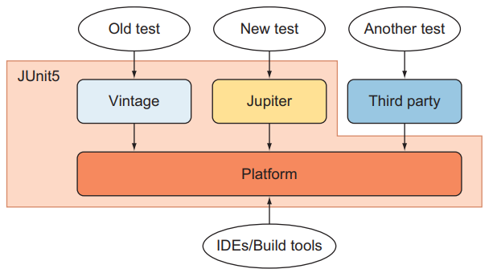
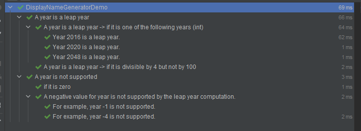

# JUnit 5

[Junit 5 User Guide](https://junit.org/junit5/docs/current/user-guide/#overview)를 참고하며,
부분적으로 JUnit in Action 3rd Edition <sub>written Cătălin Tudose</sub>을 참고한다.

## What is JUnit5?



JUnit 5 = JUnit Platform + JUnit Jupiter + JUnit Vintage

- JUnit Platform: foundation for launching testing framework on JVM
    - console launcher, JUnit Platform Suit Engine
    - exist in IDE <sub>IntelliJ, Eclipse, Visual Studio Code</sub>
- JUnit Jupiter: combination of the programming model and extension model
    - provide `TestEngine`
- JUnit Vintage: provide `TestEngine` for JUnit 3 and 4

### Demo

```java
import static org.junit.jupiter.api.Assertions.assertEquals;

import example.util.Calculator;
import org.junit.jupiter.api.Test;

class MyFirstJUnitJupiterTests {

    private final Calculator calculator = new Calculator();

    @Test
    void addition() {
        assertEquals(2, calculator.add(1, 1));
    }

}
```

## Definition

- Platform
    - Container: 트리에서 `test class`를 가지는 컨테이너
    - Test : 테스트 트리의 노드 (e.g.a `@Test` method)
- Jupiter
    - Lifecycle Method : `@BeforeAll`, `@AfterAll`, `@BeforeEach`, `@AfterEach` 가 있는 메서드
    - Test Class : 최소 1개 이상의 테스트 메서드를 가지는 클래스 <sub>top-level class, static member class or `@Nested` class</sub>
    - Test Method : `@Test`, `@RepeatedTest`, `@ParameterizedTest`, `@TestFactory`, `@TestTemplate` 가 있는 인스턴스 메서드

## Test Classes and Methods

- Teest Method와 Lifecycle Method는 테스트 클래스의 로컬로 선언되거나
    - 수퍼클래스에서 상속되거나
    - 인터페이스에서 상속 될 수 있음
- Test Method와 Lifecycle Method는 `abstract`일 수 없음

### Display Names

`@DisplayName` : 테스트 클래스와 테스트 메서드에 사용할 수 있는 테스트 이름을 지정

```java
import org.junit.jupiter.api.DisplayName;
import org.junit.jupiter.api.Test;

@DisplayName("A special test case")
class DisplayNameDemo {

    @Test
    @DisplayName("Custom test name containing spaces")
    void testWithDisplayNameContainingSpaces() {
    }

    @Test
    @DisplayName("╯°□°）╯")
    void testWithDisplayNameContainingSpecialCharacters() {
    }

    @Test
    @DisplayName("😱")
    void testWithDisplayNameContainingEmoji() {
    }

}
```

### Display Name Generators

```java
import org.junit.jupiter.api.*;
import org.junit.jupiter.params.ParameterizedTest;
import org.junit.jupiter.params.provider.ValueSource;

public class DisplayNameGeneratorDemo {

    @Nested
    @DisplayNameGeneration(DisplayNameGenerator.ReplaceUnderscores.class)
    class A_year_is_not_supported {

        @Test
        void if_it_is_zero() {
        }

        @DisplayName("A negative value for year is not supported by the leap year computation.")
        @ParameterizedTest(name = "For example, year {0} is not supported.")
        @ValueSource(ints = {-1, -4})
        void if_it_is_negative(int year) {
        }
    }

    @Nested
    @IndicativeSentencesGeneration(separator = " -> ", generator = DisplayNameGenerator.ReplaceUnderscores.class)
    class A_year_is_a_leap_year {

        @Test
        void if_it_is_divisible_by_4_but_not_by_100() {
        }

        @ParameterizedTest(name = "Year {0} is a leap year.")
        @ValueSource(ints = {2016, 2020, 2048})
        void if_it_is_one_of_the_following_years(int year) {
        }
    }
}

```

#### test result



### Display Name 우선순위

1. `@DisplayName`
2. `@DisplayNameGeneration`의 `DisplayNameGenerator`
3. 설정 파라미터의 `DisplayNameGenerator`
4. `org.junit.jupiter.api.DisplaNameGenerator.Standard`

## Assertions

- `org.junit.jupiter.api.Assertions` : 테스트 결과를 검증하는 메서드를 제공

````java
import org.junit.jupiter.api.DisplayName;
import org.junit.jupiter.api.Test;

import java.util.ArrayList;
import java.util.Arrays;
import java.util.List;
import java.util.concurrent.CountDownLatch;

import static java.time.Duration.ofMillis;
import static java.time.Duration.ofMinutes;
import static org.junit.jupiter.api.Assertions.*;

@DisplayName("Assert static methods demo")
public class AssertionsDemo {

    private final Calculator cal = new Calculator();
    private final Idol karina = new Idol.Builder("카리나", 20).isLeader(1).build();

    @Test
    @DisplayName("Standard assertions")
    void standardAssertions() {
        assertEquals(2, cal.add(1, 1));
        assertEquals(4, cal.multiply(2, 2),
                "The optional failure message is now the last parameter");
        assertEquals("카리나", karina.getMemberName(), () -> karina.toString() + "의 이름이 카리나인지 확인");
    }

    @Test
    @DisplayName("Grouped assertions (Failures)")
    void groupAssertions() {

        assertAll("karina",
                () -> assertEquals("카리나", karina.getMemberName()),
                () -> assertEquals(20, karina.getAge()));

    }

    @Test
    void dependentAssertions() {

        assertAll("karina variables",
                () -> {
                    String name = karina.getMemberName();
                    assertNotNull(name);
                    assertAll("name conventions rule",
                            () -> assertEquals(3, name.length()),
                            () -> assertTrue(name.startsWith("카")));

                },
                () -> {
                    int age = karina.getAge();
                    assertAll("age conventions rule",
                            () -> assertTrue(age > 0),
                            () -> assertTrue(age < 30));
                });
    }

    @Test
    void exceptionTesting() {
        Exception exception = assertThrows(ArithmeticException.class, () ->
                cal.divide(1, 0));
        assertEquals("/ by zero", exception.getMessage());
    }

    @Test
    @DisplayName("timeoutNotExceeded")
    void timeoutNotExceeded() {
        String actualResult = assertTimeout(ofMinutes(2), () -> {
            return "a result";
        });
        assertEquals("a result", actualResult);
    }

    @Test
    @DisplayName("timeoutNotExceededWithMethod")
    void timeoutNotExceededWithMethod() {
        String actualGreeting = assertTimeout(ofMinutes(2), AssertionsDemo::greeting);
        assertEquals("Hello, World!", actualGreeting);
    }

    private static String greeting() {
        return "Hello, World!";
    }

    @Test
    @DisplayName("timeoutExceeded")
    void timeoutExceeded() {
        assertTimeout(ofMillis(10), () -> {
            Thread.sleep(100);
        });
    }

    @Test
    void timeoutExceededWithPreemptiveTermination() {
        // The following assertion fails with an error message similar to:
        // execution timed out after 10 ms
        assertTimeoutPreemptively(ofMillis(10), () -> {
            // Simulate task that takes more than 10 ms.
            new CountDownLatch(1).await();
        });
    }

}

````

### third-party assertion library

- JUnit 팀도 third-party assertion library를 사용하는 것을 권장
    - ex. `AssertJ`, `Hamcrest`, `Truth`

```java
import org.junit.jupiter.api.DisplayName;
import org.junit.jupiter.api.Test;

import static org.hamcrest.CoreMatchers.equalTo;
import static org.hamcrest.CoreMatchers.is;
import static org.hamcrest.MatcherAssert.assertThat;

@DisplayName("Assert static methods demo")
public class AssertionsDemo {

    private final Idol karina = new Idol.Builder("카리나", 20).isLeader(1).build();

    @Test
    @DisplayName("third-party library")
    void thirdPartyLib() {
        assertThat(karina.getAge(), is(equalTo(20)));
    }

}

```

## Assumptions

- 테스트의 진행 조건 부여 가능
- 조건이 만족되지 않으면 테스트는 실행되지 않음

```java
import org.junit.jupiter.api.DisplayName;
import org.junit.jupiter.api.Test;

import static org.junit.jupiter.api.Assertions.assertEquals;
import static org.junit.jupiter.api.Assumptions.assumeTrue;
import static org.junit.jupiter.api.Assumptions.assumingThat;

public class AssumptionsDemo {

    private final Idol karina = new Idol.Builder("카리나", 20).isLeader(1).build();

    @Test
    @DisplayName("test only on ci server")
    void testOnlyCiServer() {
        assumeTrue("CI".equals(System.getenv("ENV")));
    }

    @Test
    @DisplayName("test only on dev server")
    void testOnlyDevServer() {
        assumeTrue("DEV".equals(System.getenv("ENV")),
                () -> "Aborting test: not on developer workstation");
    }

    @Test
    @DisplayName("CI server test and All environment test")
    void testInAllEnvironments() {
        assumingThat("CI".equals(System.getenv("ENV")),
                () -> {
                    // perform only in CI server
                    assertEquals(20, karina.getAge());
                });

        assertEquals("카리나", karina.getMemberName());
    }
}
```

## Disabling Tests

- `@Disabled` 어노테이션을 사용하여 테스트를 비활성화
- 클래스, 메서드 레벨에 가능

```java
import org.junit.jupiter.api.Disabled;
import org.junit.jupiter.api.Test;

public class AssumptionsDemo {

    @Test
    @Disabled("Disabled until ready for production server")
    void testProduction() {

    }
}
```

## Conditional Test Execution <sup>조건부 테스트 실행</sup>

- 프로그래밍적인 조건부로 테스트 실행
- `org.junit.jupiter.api.condition` 패키지 : 컨테이너나 테스트를 선언적오르 사용 / 미사용 처리 가능

### OS, Architecture 조건

````java
public class ConditionTest {

    @TestOnMac
    void testOnMac() {
    }

    @Test
    @EnabledOnOs({OS.LINUX, OS.MAC})
    void onLinuxOrMac() {
    }

    @Test
    @EnabledOnJre({JRE.JAVA_8, JRE.JAVA_9})
    void onlyOnJava89() {
    }

    @Test
    @EnabledIfSystemProperty(named = "os.arch", matches = ".*64.*")
    void onlyOn64BitArchitectures() {
    }

    @Test
    @DisabledIf("customCondition")
    void disabled() {
    }

    boolean customCondition() {
        return true;
    }

    @Test
    @EnabledIf("example.ExternalCondition#customCondition")
    void enabled() {
    }

}
// ...
package example;

class ExternalCondition {
    static boolean customCondition() {
        return true;
    }

}

````

- `@EnabledOnOs`, `@DisabledOnOs`
- `@EnabledOnJre`, `@DisabledOnJre`
- `@EnabledOnJreRange`, `@DisabledOnJreRange`
- `@EnabledInNativeImage`, `@DisabledInNativeImage` : GraalVM Native Image
- `@EnabledIfSystemProperty`, `@DisabledIfSystemProperty`

--- 

## Tagging and Filtering <sup>태그와 필터링</sup>


### action stack

- JAVA Application
- java 17
- junit 5.8.1

## reference

- [JUnit 5 User Guide](https://junit.org/junit5/docs/current/user-guide/#overview)
- JUnit IN ACTION <sub>written Cătălin Tudose</sub>


